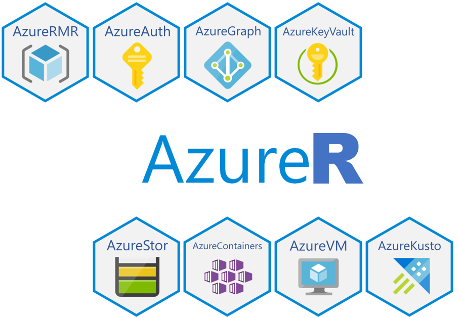

AzureR is a family of packages for working with [Azure](https://microsoft.com/azure) from R. They are designed to be lightweight yet powerful by working directly with the Azure REST API, without any dependencies on other languages.

The family includes the following members. All the packages are available on [CRAN](https://cloud.r-project.org), and the individual repositories are also mirrored at the [cloudyr project](https://cloudyr.github.io).

| Package | Description |&nbsp;&nbsp;&nbsp;&nbsp;&nbsp;&nbsp;&nbsp;&nbsp;Status&nbsp;&nbsp;&nbsp;&nbsp;&nbsp;&nbsp;&nbsp;&nbsp;|
| :-----: | ----------- | :----: |
|  | **[AzureAuth](https://github.com/Azure/AzureAuth)** provides [Azure Active Directory](https://docs.microsoft.com/azure/active-directory/develop/index) authentication functionality. Use this package to obtain OAuth 2.0 tokens for any Azure service that uses AAD for authentication. It supports AAD v1.0 and v2.0; authenticating with certificates; and multiple authentication flows, including authorization code, device code, client credentials, on-behalf-of and resource owner grant. |        |
|  | **[AzureRMR](https://github.com/Azure/AzureRMR)** is an R6-based interface to [Azure Resource Manager](https://azure.microsoft.com/features/resource-manager/). It enables working with subscriptions, resource groups, resources and templates: resources can be created, updated and deleted, templates can be deployed and removed, and role-based permissions assigned. Most of the other AzureR packages extend AzureRMR to provide more features specific to a given service. |        |
|  | **[AzureGraph](https://github.com/Azure/AzureGraph)** is an R6-based interface to [Microsoft Graph](https://developer.microsoft.com/graph/), focusing on Azure Active Directory. Its main functionality revolves around registered apps and service principals, with a view to supporting the other packages in the family, but it can also be used to manage other objects in Graph. |        |
|  | **[AzureKeyVault](https://github.com/Azure/AzureKeyVault)** provides a Resource Manager and client interface to [Azure Key Vault](https://azure.microsoft.com/services/key-vault/). It supports all operations with objects stored in Key Vault, such as encryption and decryption, certificate signing, and storage account key management. |        |
|  | **[AzureStor](https://github.com/Azure/AzureStor)** provides a Resource Manager and client interface to [storage accounts](https://azure.microsoft.com/Services/Storage). The client interface currently supports blob, file and Data Lake Gen2 storage. Features include parallel file transfers, retry on error, and an interface to the AzCopy v10 utility. |        |
|  | **[AzureContainers](https://github.com/Azure/AzureContainers)** provides a Resource Manager and client interface to containers: [Azure Container Instances](https://azure.microsoft.com/services/container-instances/), [Azure Container Registry](https://azure.microsoft.com/services/container-registry/), and [Azure Kubernetes Service](https://azure.microsoft.com/services/kubernetes-service/). Build a Docker image and push it to ACR; deploy it to ACI; or create a service on AKS. As a bonus, AzureContainers can talk to any Docker registry or Kubernetes cluster, not just those in Azure. |        |
|  | **[AzureVM](https://github.com/Azure/AzureVM)** is a package for deploying and interacting with [virtual machines](https://azure.microsoft.com/services/virtual-machines/) and [virtual machine scalesets](https://azure.microsoft.com/services/virtual-machine-scale-sets/). It provides a flexible, powerful interface that lets you customise nearly all aspects of the deployment, including reusing existing resources. A selection of predefined configurations is also included to allow easy deployment of commonly used Linux and Windows images. |        |
|  | **[AzureKusto](https://github.com/Azure/AzureKusto)** provides a Resource Manager and client interface to [Azure Data Explorer](https://azure.microsoft.com/services/data-explorer), also known as Kusto. Its features include dplyr and DBI interfaces to Kusto, as well as the ability to manage clusters and database principals. |        |

Currently, AzureR is not intended to support all of Azure; its focus is mainly on the Azure services that are most likely to be relevant to R users.

